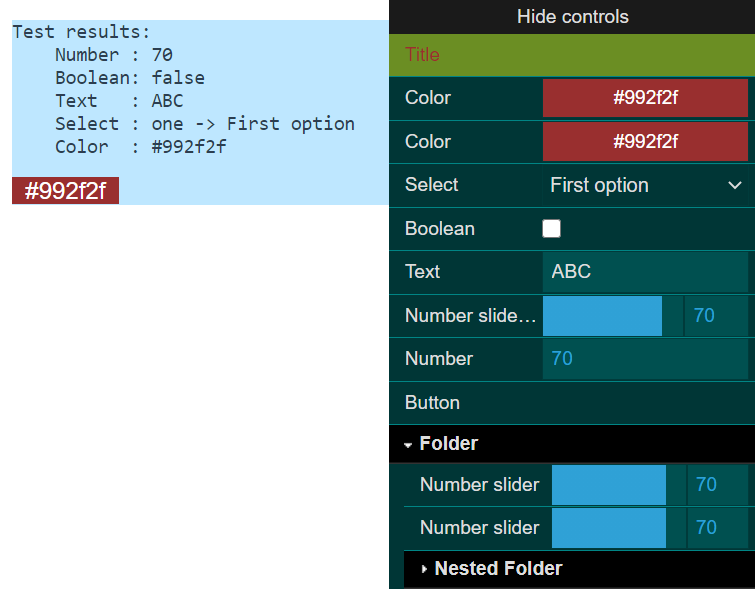

# auto-dat-gui

Port of popular [dat.GUI](https://github.com/dataarts/dat.gui) on Vue3 composition API.

#### DEMO 👀
Check out [the demo page](https://maxzz.github.io/auto-dat-gui/).



## Goals

* Make a modern Vue 3 compatible library for rapid prototyping.
* Minimize dependencies and make this project extremely lightweight and easy to prototype.
* Eliminate the use of old libraries and unnecessary outdated polyfills.

## Project
setup
```
yarn install
```

Compiles and hot-reloads for development
```
yarn serve
```

Compiles and minifies for production
```
yarn build
```

<b>Customize configuration</b>
See [Configuration Reference](https://cli.vuejs.org/config/).

## Thanks🥑

This project is largely inspired by the following great projects: [vueuse](https://github.com/antfu/vueuse), [devtools-frontend](https://github.com/ChromeDevTools/devtools-frontend), [pure-color](https://github.com/WickyNilliams/pure-color), [v-color](https://github.com/v-comp/v-color), [v-ctrl](https://github.com/v-comp/v-ctrl), [lodash](https://github.com/lodash/lodash)

## TODO

* Generate data model view on the fly
* Customizations
* Bug fixing
* Switch from webpack to build rollup
* Make library build
* npm package deploy